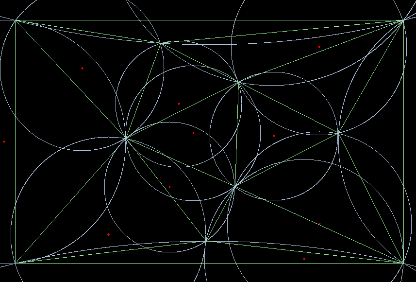
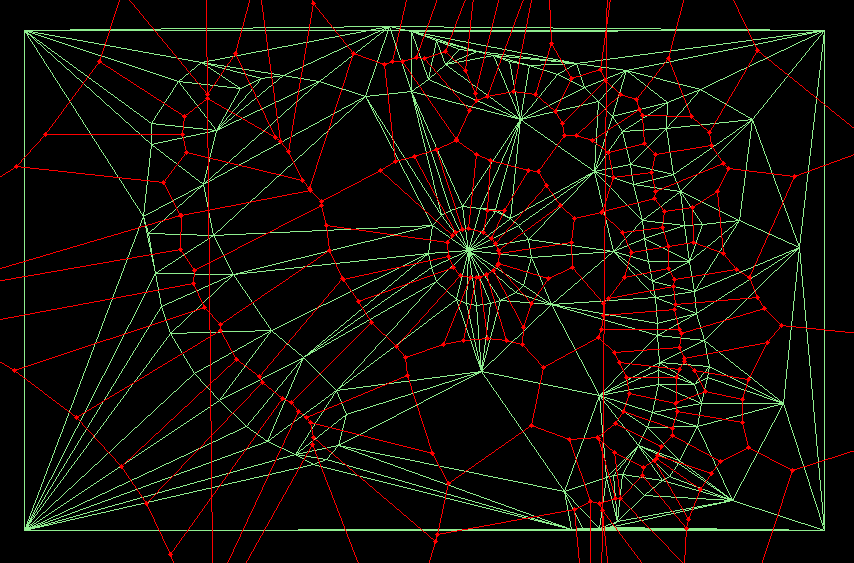
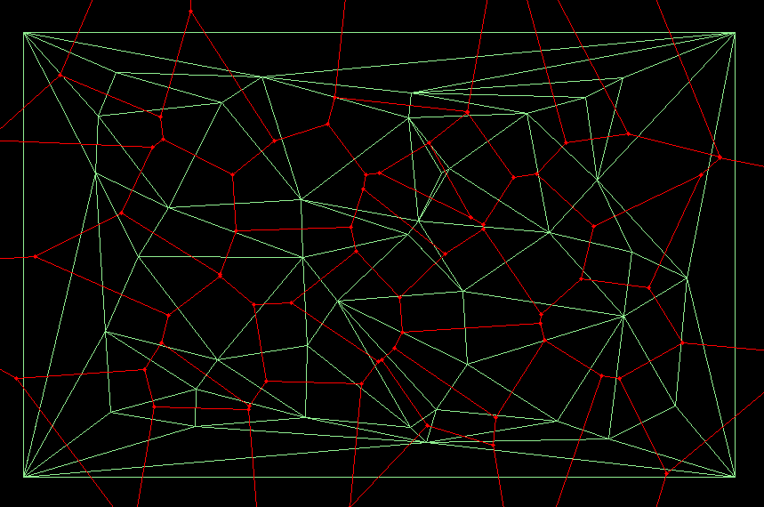
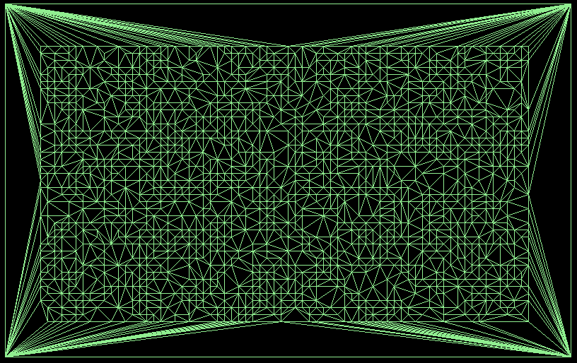

# Objectif : Triangulation 2D/3D
   Fait ->
   
        1) Etude
        
        2) Triangulation de Delaunay 2D
        
        3) Ajout du diagramme de Voronoï (T)
        
   A faire ->
   
        4) On cherche à déterminer quels sont les arêtes de T qui ne sont pas sur la surface : Algorithme de Crust
        
        5) ... 3D

## Etude

En mathématiques et plus particulièrement en géométrie algorithmique, la triangulation de Delaunay d'un ensemble P de points du plan est une triangulation DT(P) telle qu'aucun point de P n'est à l'intérieur du cercle circonscrit d'un des triangles de DT(P). Les triangulations de Delaunay maximisent le plus petit angle de l'ensemble des angles des triangles, évitant ainsi les triangles « allongés ». Cette triangulation a été inventée par le mathématicien russe Boris Delaunay.

    https://fr.wikipedia.org/wiki/Attracteur_de_Lorenz

## Resultats

